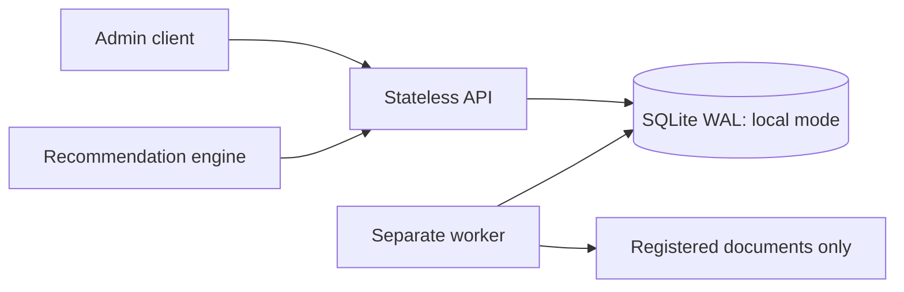
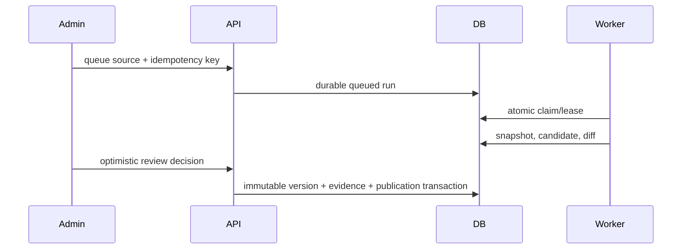
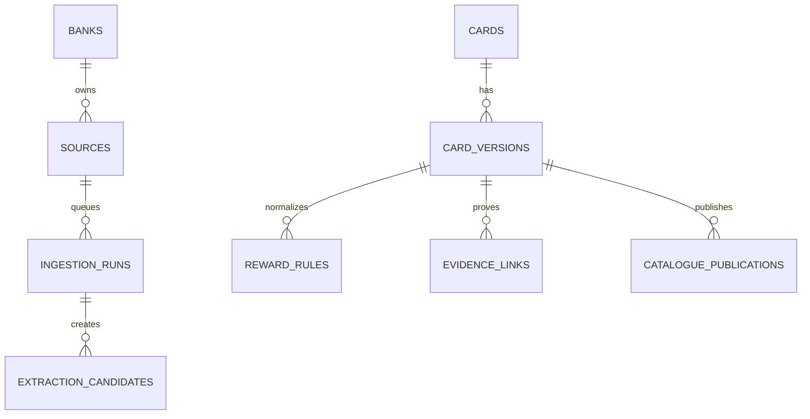

# Architecture

API and worker are intentionally separate. The worker claims a queued row under a short write transaction; its lease makes duplicate processing observable and recoverable. Publication is one transaction, so a failed version/rule/evidence write cannot replace a current card. Last-good public versions are never removed by partial ingestion failures.

SQLite is selected for a dependency-free local baseline. WAL, foreign keys, busy timeout, indexed candidate queues, source freshness, idempotency expiry, and card-version lookup are implemented. It is not a multi-host or multi-replica deployment: use a real PostgreSQL backend before such deployment. Bounded request/evidence sizes, pagination, cursor expiry, response ETags, and one-shot workers constrain resource use.
