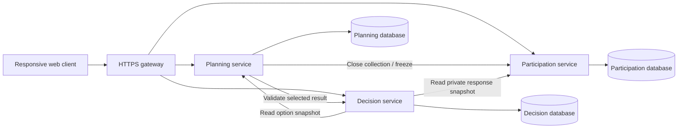

# What2Do — review and implementation plan

## 1. Product direction

**Problem statement**

Groups need to choose an activity and time while accommodating different availability, spending limits, and preferences. Collecting those answers does not by itself resolve conflicts or explain the trade-offs. How can a shared planning experience help a group reach an understandable, feasible decision and keep that decision current when circumstances change?

**Proposed solution**

An organiser creates a planning session with several activities and time windows. Members open an invitation link and submit a short response. What2Do checks which activity–time combinations meet the group's stated requirements, ranks feasible alternatives using a documented preference policy, explains conflicts, and records the organiser's selected plan. Members then confirm attendance separately.

**Product promise:** “Find a plan your group can agree on, and understand why it works.”

The audience can remain broad: friends, families, clubs, and colleagues. The first implementation should handle single-session activities such as meals, outings, and gatherings. Multi-day travel and open-ended decisions such as where to live need different models and are outside this release.

Existing products already support date polling and questionnaires. Partiful documents both. The proposed contribution is the combined constraint checking, explained ranking, conflict recovery, and versioned confirmation flow. Validate that this combination improves the experience; do not claim that these individual features are unprecedented. [Partiful polling documentation](https://help.partiful.com/en-us/articles/15525422-can-i-poll-or-survey-my-guests)

## 2. Review of initial planing

| Proposal in the notes | Assessment and recommended change |
| --- | --- |
| Keep member participation similar to a simple form | Keep. Use progressive steps, mobile-friendly controls, autosaved drafts, and a clear completion state. |
| Organiser supplies candidate outcomes | Keep. It avoids dependence on venue discovery, scraping, or external booking systems. Make options easy to duplicate and edit. |
| Time, budget, and preferences are core inputs | Keep, but give each an explicit meaning and data type. |
| An outcome can consist of only its name | Allow as a draft. Require duration, eligible windows, and a per-person cost estimate before publishing an evaluable option. |
| Pick an activity | Pick an **activity plus a start and end time**. An activity without a feasible time is not a complete recommendation. |
| Display a confidence score | Replace with availability, cost compatibility, response completeness, and preference metrics. A deterministic fit score is not a probability of a successful event. |
| Interpret arbitrary text and infer relationships | Defer. Free text is notes in the MVP. A later AI helper may draft fields, but the author must confirm them before they affect decisions. |
| Support custom checkboxes, text fields, and arbitrary mappings | Start with fixed core fields and a small controlled attribute list. Extra custom questions can be informational later. |
| Flexible months, weekdays, time-of-day labels, and specific dates | Start with specific dates and 30-minute increments. Recurring schedules and vague periods add ambiguity without proving the core product. |
| Budget can be cheap/average/expensive | Use numeric per-person limits in SGD. Such labels can only work if their numerical meaning is explicitly defined. |
| KBBQ implies unsuitable for vegetarians | Do not infer this from the activity name. Actual venue information and the participant's stated requirements determine compatibility. Unknown remains unknown. |
| More activity categories demonstrate scalability | This demonstrates product flexibility. Scalability needs evidence about concurrent groups, reads, writes, recommendation requests, and resource use. |

The main missing decisions are: what “best” means, who must be included, what happens when no option works, how incomplete responses are treated, who may see private constraints, and what happens after a plan changes.

## 3. MVP boundaries

Suggested initial product limits: 2–30 attendees, 2–8 activities, a date range up to 14 days, 30-minute time increments, one time zone per plan, and one estimated per-person cost per activity. These are design limits to validate, not claims about measured capacity. Use Asia/Singapore and SGD by default.

**Required for submission**

- Organiser sign-in; create, edit, publish, and archive a session.
- Shareable invitation and participant identity scoped to the plan.
- Mobile response form: availability, budget, activity ratings, and explicit cannot-join/needs-information flags.
- Response progress, an agreed attendee roster, and a response deadline.
- Deterministic feasibility checks and ranked activity–time combinations.
- Explained alternatives and a useful no-feasible-plan screen.
- Review, select, confirm, RSVP, and reopen a changed plan.
- Private response access, validation, versioning, and duplicate-request protection.
- Deployed microservices, automated tests, CI/CD, and reproducible performance evidence.

**Add only after the complete core works**

- Calendar-file download and in-app reminders.
- Activity templates that prefill the same schema.
- Live result previews and efficient availability bitsets, if benchmarks justify them.
- One AI-assisted option-description parser with mandatory confirmation.

**Defer**

Automatic venue search, venue bookings, payments, full chat, social feeds, calendar-account integration, multi-day itineraries, currency conversion, quorum policies, multi-round fairness across past events, arbitrary form builders, and unrestricted semantic decision-making.

## 4. Core inputs and their meaning

### Organiser

- Title, short description, attendee target, response deadline, and plan time zone.
- Candidate dates and daily windows. Each activity can narrow those windows.
- For each activity: title, location/details, duration, estimated upper per-person total cost, and relevant attributes with values **yes / no / unknown**.
- Review the joined roster before closing responses. The organiser submits a member response if attending.

Closing requires the organiser to reconcile the attendee target with that roster. If eight are expected and only six have joined, the app must wait or require an explicit, visible roster/target change before closing. It must not redefine those six as the whole group automatically.

A cost of zero means free. A missing cost means unevaluated. Include known mandatory charges in the estimate and clearly label it as an estimate; the application cannot guarantee an external venue's final price. Fixed group costs that change with attendance are deferred.

Publishing locks the decision-relevant option fields for that round. Changing an activity, duration, time window, cost, or required attribute creates a new round. Previous responses can be copied as drafts, but members must review and resubmit them; old ratings are never silently applied to a changed option. Simple spelling corrections that do not change meaning may be separately audited.

### Member

1. Display name and private plan-scoped session.
2. Availability across proposed dates, with a keyboard-accessible alternative to drag selection. Unmarked periods in a submitted response mean unavailable.
3. Maximum spend per person, or an explicit “No spending limit.” An unanswered field is neither zero nor unlimited.
4. Rate each activity: strongly dislike = 0, dislike = 1, neutral = 2, like = 3, love = 4. “No preference” explicitly maps to neutral; missing answers remain incomplete.
5. Optional fixed hard requirements and per-option “Cannot join” or “Need more information.” A dislike alone is a soft preference.
6. Optional private note, clearly labelled as not used by the algorithm.

For each option, either a rating/no-preference choice or an explicit cannot-join/needs-information flag counts as an answer. A flagged option does not require a rating. Needs-information can be part of a complete response while leaving that candidate unresolved; a truly unanswered option leaves the response incomplete. Only joinable, fully evaluated candidates reach preference ranking.

Keep hard requirements simple. For example, a controlled attribute such as step-free access can be checked against the organiser's reported venue information. Unknown attributes cannot satisfy a required attribute. Include per-option flags so users can express a constraint not covered by the fixed list without requiring text interpretation.

Availability must cover the **whole activity duration**, not merely its starting slot. A three-hour activity needs six consecutive available 30-minute slots. Store timestamp instants with the plan's IANA time-zone identifier; display the zone throughout. Recurrence is deferred.

## 5. Main screens and journey

| Screen | Main purpose |
| --- | --- |
| Organiser dashboard | Continue a draft; see collecting, reviewing, and confirmed sessions. |
| Create-session wizard | Enter group details, time windows, activities, and cost estimates; preview member form. |
| Invitation landing page | Explain the purpose, response deadline, privacy, and expected participation effort. |
| Member response form | Complete and edit the member's own response while collection is open. |
| Progress dashboard | Show joined and completed counts; review roster; close collection when ready. |
| Recommendation comparison | Show the best-balanced feasible choices, their times and costs, and plain-language explanations. |
| Conflict-resolution view | Explain missing information or incompatible constraints and offer concrete organiser actions. |
| Confirmed plan | Show the selected details, cost estimate, version, attendance confirmations, and change requests. |

A suggested usability goal is that a first-time member can submit a complete response in about two minutes for four activities. Measure and revise this target with users; it is not a proven result.

## 6. Decision algorithm

### Feasibility policy

For the MVP, every attendee in the organiser-approved roster must have a complete, current response, and the chosen candidate must satisfy each attendee's hard constraints. Never silently drop a member to produce a winner. A separate future quorum mode would need explicit rules and different explanations.

While responses are incomplete, progress and provisional previews may be shown, but final selection is blocked. Show “6 of 8 expected members responded”; do not present this as “everyone is available.” Changing the roster or expected count must be an explicit organiser action.

### Candidate generation

For every activity, enumerate starts on the time grid whose full duration fits inside an allowed activity window. Each candidate is `(activity_id, start_at, end_at, option_revision)`.

For member `i` and candidate `c`, eligibility requires:

`full_duration_available(i,c) AND estimated_cost(c) <= budget_cap(i) AND hard_requirements_met(i,c) AND option_joinable(i,c)`

An explicit unlimited budget passes the budget check. Unknown required facts or a needs-information flag make a candidate unresolved. It cannot be confirmed as feasible.

All-member feasibility is the logical AND of eligibility across the roster. Keep failed checks for explanations, rather than compensating for them with a higher preference score.

### Rank feasible candidates

Use one published policy initially:

1. Higher minimum member rating.
2. Higher average member rating.
3. Lower estimated cost.
4. Earlier start, then stable option ID for deterministic ties.

This prioritises avoiding a strongly disliked choice before maximising average enthusiasm. It is one defensible fairness policy, not a universal definition of fairness. It can be sensitive to strategic ratings; document this limitation. Do not secretly change weights for the organiser.

An optional displayed preference score is `100 × average_rating / 4`. Label it **average preference**, not confidence. Because minimum rating ranks first, a lower-average option can legitimately rank higher; the explanation must make that clear. Counts such as “four like or love it, two are neutral” may be easier to understand than a number.

Show up to three useful alternatives; avoid filling the view with nearly identical start times for one activity. A simple display rule can take the best start for each activity before offering “More times.” This is presentation grouping and must not alter the underlying ranking.

### No feasible plan

Separate three states: waiting for responses, missing option information, and genuine incompatibility. Provide actions such as adding a cheaper option, adding another time window, or asking a member to clarify an unknown requirement. Members can voluntarily update their own constraints. Never relax a budget or availability constraint automatically.

Avoid claiming a mathematically minimal set of changes unless that is actually computed. Describe suggestions as possible next steps. Shared explanations must not reveal individual spending caps or private notes.

### Efficiency and evidence

Let `N` be members, `C` be generated candidates, `L` be maximum activity length in grid slots, `K` be hard attributes, and `F` be feasible candidates. A direct implementation takes approximately `O(C × N × (L + K))`, plus `O(F log F)` to sort. It is likely sufficient for ordinary groups; measure before optimising.

A first improvement is a prefix count of unavailable slots per member, built in `O(N × T)` for `T` time slots. A whole-duration availability check then takes constant time. Budget/attribute checks can be computed once per member–activity pair, and preference statistics once per activity. Bitsets are a further benchmarkable alternative, not a required complexity badge.

Keep the straightforward implementation as a correctness oracle. Optimised implementations must return identical eligibility, scores, and ordering under the same policy. Preference-policy comparisons and code-performance comparisons are different experiments.

## 7. Worked demonstration fixture

Six attendees have budget caps of **$40, $30, $35, $25, $30, $50**. Everyone is available Friday 19:00–21:00. One member is unavailable Saturday 14:00–16:00. All other required facts are known and satisfied.

| Activity and time | Estimated cost | Ratings | Expected result |
| --- | --- | --- | --- |
| Board-game café, Friday 19:00–21:00 | $20 | 4, 3, 3, 2, 4, 3 | Feasible; average preference 79.2/100; five like/love it and one is neutral. |
| Picnic, Saturday 14:00–16:00 | $15 | 4, 4, 3, 3, 4, 4 | Infeasible: a member is unavailable, despite higher preference. |
| Dinner, Friday 19:00–21:00 | $35 | 4, 4, 4, 4, 4, 4 | Infeasible: exceeds three spending caps, despite perfect preference. |

The internal fixture includes individual inputs for testing. The shared product view does not expose individual budgets or identify who caused a budget conflict.

Next, change the café estimate to $28 in a new round. It now exceeds one spending cap, and no listed plan is feasible. The app should offer revision actions. After the organiser supplies a suitable alternative and members review the updated options, the group can confirm again.

## 8. Microservice architecture

Use three services divided by business responsibility. A suggested stack is React with TypeScript for the frontend, NestJS with TypeScript for Planning and Participation, and FastAPI with Python for Decision. If the team already knows another framework well, substitute it before development begins. Mixed languages are optional; independent ownership and deployment establish the service boundaries.

| Service | Owns | Frontend feature ownership |
| --- | --- | --- |
| Planning | Organiser identity integration, plans, rounds, activities, membership, invitations, state transitions, immutable selections | Dashboard, setup wizard, confirmed-plan view |
| Participation | Member response drafts/submissions, availability, private budgets, preferences, response snapshots, RSVPs | Invitation, response form, progress and RSVP UI |
| Decision | Pure matching/ranking library, recommendation runs, snapshot references, explanation codes, algorithm version | Results comparison and conflict-resolution UI |

Use separate logical databases and credentials. One PostgreSQL instance can host all three to control costs, but services must not query each other's tables. Exchange opaque IDs and versioned API objects. This initial database instance remains shared infrastructure and a possible bottleneck; do not claim fully independent scaling of the data tier.

Keep authentication based on an established library/provider. Planning owns plan-scoped invitations and guest identities. Services verify scoped credentials and current plan access; a display name or supplied participant ID is not authorisation. Do not create a fourth authentication service unless the course explicitly requires it.

Use REST/JSON and OpenAPI contracts. NestJS and FastAPI both document OpenAPI support. Keep one repository with separate frontend/service folders, contracts, migrations, tests, and infrastructure. Each service gets its own container and health endpoint. [NestJS](https://docs.nestjs.com/openapi/introduction), [FastAPI](https://fastapi.tiangolo.com/features/)

Use ordinary reads and short polling first. Server-sent updates can be added later. A message broker, Kubernetes cluster, and bespoke gateway are not prerequisites for this scope. Use the team's familiar container hosting platform and an ordinary reverse proxy or managed gateway.

## 9. Correctness across services: review and confirmation

Use a deliberate close-and-review flow so results cannot be confirmed against changing responses.

`DRAFT → COLLECTING → LOCKING → REVIEW → CONFIRMED → ARCHIVED`

Reopening creates a new round; it does not overwrite the historical confirmed version.

1. Planning atomically changes the round to LOCKING and freezes its option version and roster. Further option edits and joins for that round stop.
2. Planning calls Participation's internal freeze endpoint with a unique round operation ID. Participation locks its round record, waits for in-flight writes to commit, closes response writes, and creates an immutable response snapshot. Every response write must use the same round-state guard in its transaction.
3. Participation returns the snapshot ID and revision. Planning moves to REVIEW and records a readiness status. Missing or stale responses produce `REVIEW_BLOCKED` reasons within that state; confirmation is disabled. LOCKING is reserved for an unfinished freeze. Reopen collection to resolve blocked inputs rather than quietly omitting them.
4. Decision evaluates the immutable option and response snapshots. Store their references and `algorithm_version` with the result.
5. Confirmation validates the selected candidate's feasibility and snapshot references, then commits one immutable selection in Planning. Use an idempotency key for retries.
6. Participation records each attendee's explicit RSVP against that selection version. Predicted availability is not an RSVP. A later decline marks the plan as needing attention, without silently selecting a different activity.

Freeze and confirmation operations must be retryable. If a freeze response is lost, retrying the same operation returns the same snapshot. A failed freeze leaves the UI in an explained, retryable state. Any reopen uses a new round ID, so late messages from an old operation cannot freeze the new round.

Reopening retains stable plan-scoped member identities and the roster, so members do not join again. Participation copies previous answers into private drafts for the new round, preserving unchanged values and highlighting what changed. Each member reviews and resubmits; only current submissions count. A guest's session or private recovery credential identifies them across rounds. A shared invitation or a matching display name never grants access to an existing member's response.

Use local database transactions and explicit state/version checks. PostgreSQL documents the relevant locking and concurrency behaviour. This protocol avoids relying on a cross-service read followed by an unchecked confirmation write. [PostgreSQL locking](https://www.postgresql.org/docs/current/explicit-locking.html)

## 10. Data model and API outline

| Owner | Main entities | Important constraints/indexes |
| --- | --- | --- |
| Planning | users, plans, rounds, activities, activity_windows, activity_attributes, memberships, invitations, selections | Owner/status lookup; unique member per round identity; option-to-round FK; one selection per round; version-checked state updates |
| Participation | response_rounds, responses, availability_intervals, activity_ratings, requirements, option_flags, response_snapshots, rsvps | Unique round/member response; unique response/activity rating; checks on ratings and nonnegative amounts; indexes on round and member; unique selection/member RSVP |
| Decision | recommendation_runs, candidate_results, explanation_records | Unique input-snapshot pair plus algorithm version; run status; run/candidate lookup |

Snapshots may use validated, versioned JSON for immutable inputs. Keep live relational data normalised. Money uses integer minor units. Do not log private snapshots or use raw responses as cache keys. No foreign keys can cross service databases; validate referenced IDs through service contracts.

Illustrative endpoints:

- Planning: `POST /plans`, `POST /plans/{id}/activities`, `POST /plans/{id}/publish`, `POST /invites/{code}/join`, `POST /rounds/{id}/close`, `POST /rounds/{id}/confirm`, `POST /plans/{id}/reopen`.
- Participation: `GET/PUT /rounds/{id}/my-response`, `POST /rounds/{id}/my-response/submit`, `GET /rounds/{id}/progress`, `POST /selections/{id}/my-rsvp`.
- Decision: `POST /rounds/{id}/recommendations`, `GET /recommendations/{runId}`.
- Internal-only: versioned option snapshot, freeze response round, private response snapshot, and candidate validation endpoints.

Define shared schemas and examples in week one. Include typed reason codes such as `INCOMPLETE_RESPONSE`, `MISSING_OPTION_FACT`, `NO_TIME_OVERLAP`, `BUDGET_CONFLICT`, `STALE_VERSION`, and `ROUND_CLOSED`. Use consistent status codes: unauthenticated/forbidden, not found, invalid input, stale-state conflict, and retryable service failure. Internal snapshots and freeze endpoints must not be exposed through the public gateway.

## 11. Privacy and permissions

- Organisers manage the plan and see completion status and approved aggregate results. They do not automatically get individual budget caps or private notes.
- Members read and edit only their own responses. A shared join link cannot retrieve or overwrite someone else's submission.
- Use high-entropy invitation secrets, secure sessions, revocable access, rate limits, and plan/member authorisation on every endpoint. Keep tokens and raw response values out of logs and analytics.
- Display shared conflict messages at an appropriate level, for example “This exceeds a member's budget.” Aggregates in small groups can still reveal information; avoid promising anonymity.
- Use scoped service credentials for private snapshot access. Persist the minimum explanation data needed for results and testing.
- Provide an archive/delete workflow with a documented data-retention policy for the prototype.
- Guest identities reduce sign-up friction but are not proof of real-world identity. Let organisers review the roster and remove accidental duplicates before closing collection.

## 12. Six-week delivery plan

| Week | Deliverable | Exit condition |
| --- | --- | --- |
| 1 | Agree data meanings and ranking; test a clickable flow; define API contracts; scaffold services, database migrations, Docker, and CI; deploy a skeleton | A user can create a plan and submit a basic response through deployed service endpoints; teams share fixtures |
| 2 | Complete the first end-to-end journey with naive ranking | Create → invite → respond → close → recommend → select → RSVP works with a small group; no UI-only placeholders on this path |
| 3 | Add complete-duration checks, budgets, hard requirements, private response access, robust freeze/reopen, and useful empty/error states | Stale selections fail; incomplete groups cannot be presented as complete; no feasible plan is handled clearly |
| 4 | Improve mobile UX and explanations; pilot with real groups; implement the chosen efficiency improvement and meaningful integration tests | Pilot users complete core tasks; naive and improved algorithms agree on seeded tests; critical permission and concurrency checks pass |
| 5 | Run load/failure tests; compare one versus two API instances behind a load balancer; fix measured bottlenecks; finish documentation | Recorded performance report, service-failure recovery evidence, automated deployment and rollback procedure |
| 6 | Feature freeze, bug fixes, usability retest, final report, video/demo rehearsal, backup demo data | Reproducible setup and deployment; stable full demonstration; every rubric category has evidence |
| Optional 7 | Contingency, polish, and one preselected stretch feature only if all core gates passed | No late feature compromises the working submission |

If the week-two journey is late, cut live previews, advanced visualisations, bitsets, calendar export, and AI assistance first. Preserve the complete decision lifecycle, privacy, correctness, and deployment.

## 13. Six-person division

Organise three pairs around complete user flows, with frontend and backend work in every pair.

| Pair | Primary ownership | Cross-team responsibility |
| --- | --- | --- |
| A: members 1–2 | Planning service, organiser setup/dashboard, selected-plan view | One deployment lead and one integration/API-contract lead |
| B: members 3–4 | Participation service, availability UI, budgets/preferences, invitations, RSVP | One accessibility/usability lead and one security/data-model reviewer |
| C: members 5–6 | Decision service, ranking, comparison UI, conflict explanations | One algorithm/benchmark lead and one end-to-end testing lead |

These are coordination roles, not exclusive assignments. Every member writes tests, documents their changes, reviews another pair's work, and can explain the whole system. Integrate small changes daily and demonstrate the deployed product together weekly. Keep a shared issue board with acceptance criteria and visible ownership.

## 14. Testing and evaluation

**Correctness:** exact budget equality; free versus missing cost; unlimited versus missing budget; partial-duration availability; adjacent intervals; time-zone conversions; no preference versus missing rating; unknown requirements; ties; incomplete roster; impossible plan; and all hard constraints dominating soft scores.

**Concurrency and failure:** simultaneous response edits; edits racing with freeze; repeat freeze after a lost response; concurrent confirmation requests; service timeout; stale round requests after reopen; invitations revoked during use; and RSVP attached to the correct selection version. A Decision outage must not erase responses.

**Permissions:** changing a member ID does not expose their response; another organiser cannot access the plan; shared result endpoints omit private values; guest tokens cannot invoke organiser/internal operations.

**Algorithm performance:** measure the naive and optimised versions on identical seeded data, including realistic small groups and larger synthetic cases. Report candidate count, N, time-grid size, runtime, memory, and result equality. Small-group overhead can outweigh an optimisation; report that honestly.

**Policy evaluation:** compare preference-only voting, feasible mean-rating ranking, and the proposed feasible minimum-then-mean ranking. Report constraint violations, average rating, and minimum rating separately. Do not portray the deliberately simpler baseline as the best possible competitor.

**System load:** a provisional target is 100 active planning sessions with 10 attendees each, with a documented mixture of reads and response updates and bounded concurrent recommendation requests. This is a load scenario, not a claim that 1,000 users write simultaneously. Provisional goals: p95 ordinary API response below 500 ms, recommendation response below 2 seconds within product limits, and zero lost accepted responses or stale confirmations. Record hardware, data size, workload, errors, and resource use; revise targets from measured evidence.

**Usability:** recruit several real groups with consent. Compare the same planning task against a basic form/date-poll workflow, counterbalance task order where possible, and measure member completion time, organiser decision time, clarification messages, errors, and understanding of trade-offs. A small pilot provides formative evidence, not proof for all users.

## 15. Rubric evidence to prepare

| Rubric category | Evidence in this project |
| --- | --- |
| Database design | Service-owned schema diagrams, integrity constraints, migration history, indexes justified with query plans |
| Scalability | Reproducible workload, one/two-instance comparison, bottleneck explanation, resource measurements |
| Project complexity | Constraint-aware decision process, versioned confirmation, and recovery across service failures |
| Code cleanliness | Small pure algorithm functions, typed contracts, clear modules, reviews, linting |
| Backend API design | OpenAPI, consistent validation/errors, scoped authorisation, idempotent commands |
| Frontend | Mobile participation, accessible time input, clear results/conflicts, loading and retry states |
| Cloud deployment | Containers, automated CI/CD, managed data service where appropriate, health checks, cost and rollback notes |
| Innovation | Measured improvement in the combined group-decision workflow and explanation quality |
| Documentation | Setup, architecture, API examples, scoring policy, data meanings, assumptions, limitations |
| Testing | Critical unit, contract, integration, browser, concurrency, and load tests |
| Teamwork | Shared planning, balanced issue ownership, cross-pair reviews, evidence of integration |

The rubric lists these categories without explicit relative weights. This plan does not assume that algorithms alone determine the grade.

## 16. Final demonstration and immediate actions

Demonstrate one coherent story: create a session; submit conflicting responses; show why a popular option fails; select a feasible alternative; introduce a change that makes every option infeasible; revise and recollect; confirm the new plan; receive explicit RSVPs. Show a brief concurrency test and a measured performance comparison after the user journey.

For the first two working days:

1. Approve the supported input meanings, all-member policy, ranking order, and deferred scope.
2. Assign the three pairs and choose frameworks the team already knows.
3. Sketch the organiser, participant, results, and no-feasible-plan screens.
4. Agree API request/response examples and the freeze/reopen protocol.
5. Create shared fixture data, a repository, CI, and the first cloud deployment.

Success for this capstone means a complete and understandable planning experience with defensible engineering evidence. Broader activity categories and optional AI features can follow once that experience works reliably.

## Sources and assumptions

- User-supplied “Project Notes” overview: reviewed in full; proposals were assessed rather than treated as instructions to implement.
- User-supplied `Final Capstone Rubrics.xlsx`, Sheet1, A2:C12: grading categories and excellent-performance descriptions inspected earlier in this conversation.
- User confirmation: six members, approximately 6–7 weeks, microservice architecture with a flexible technology stack.
- [Partiful polling and questionnaire documentation](https://help.partiful.com/en-us/articles/15525422-can-i-poll-or-survey-my-guests), checked 23 September 2026.
- [NestJS OpenAPI documentation](https://docs.nestjs.com/openapi/introduction), [FastAPI features](https://fastapi.tiangolo.com/features/), and [PostgreSQL locking documentation](https://www.postgresql.org/docs/current/explicit-locking.html), checked 23 September 2026.
- Limits, dates by project week, performance targets, ranking policy, and framework choices in this document are proposed design decisions. They are not measured outcomes or additional course requirements.
